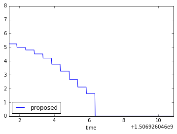
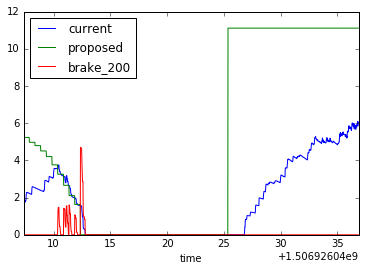
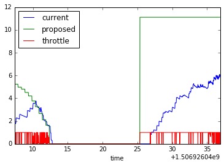

# Programming a Real Self-Driving Car
Self-Driving Car Engineer Nanodegree Program, Capstone Project

## Project Overview

The goal of this project is to design a miniature self driving car system that enable Udacity car Carla  to drive around the test track using waypoint navigation. Traffic lights are placed in the test track, Carla needs to stop and start properly depending on the traffic light in front of it. Our system consists of three major components. Perception component detects and classify the traffic light ahead of the car via images captured from the car camera. Planning component set target velocity for the waypoints ahead of vehicle depending on desired vehicle behavior.  Control component  actuates the throttle, brake,and steering to successfully navigate the waypoints with correct target velocity. A car/test track simulator is also provided to facilitate the development so that we can test our codes before submitting them to be tested on Carla.

[Here](https://youtu.be/pQUkeQn9QPk) is the project video.

## Usage

1. Clone the project repository
```bash
git clone https://github.com/udacity/carnd_capstone.git
```

2. Install python dependencies
```bash
cd carnd_capstone
pip install -r requirements.txt
```

3. If you're using Git LFS (https://git-lfs.github.com/) you can skip this step becuase you already downloaded the model when you cloned this repositoy in the step1.

   Prepare the classification model : Download our frozen classification model from here : https://github.com/seya/lazzzy_boys/blob/master/traffic_light_classifier/logs/deploy/graph_optimized.pb. Then create a new folder ./traffic_light_classifier/logs/deploy and put graph_optimized.pb file it into that folder.

4. Make and run styx
```bash
cd ros
catkin_make
source devel/setup.sh
roslaunch launch/styx.launch
```

5. Run the simulator
```bash
unzip lights_no_cars.zip
cd lights_no_cars
chmod +x ros_test.x86_64
./ros_test.x86_64
```

## Project Components

### 1. Nodes


#### 1.1 Perception

In our project, the position of traffic lights in test track are already provided. Perception model starts collecting camera images when it's within certain distance from the traffic light and classify the image as one of the three status: RED, YELLOW, and GREEN. Carla is required to run at 10mph at maximum, and its speed is relatively slow, so we we start collecting camera images when the traffic light is 40 meters away.  


Inception V4 model are selected as our classifier model, and we use one single model to classify traffic light images from both simulator and site.  

##### 1.1.1 Dataset
As the classifier is expected to work in both simulator and site, images from both sources are collected.  

A scripts is developed to automatically collect and images from simulator.

|                                    | 0-red | 1-yellow | 2-green | Sum  |
|:-----------------------------------|:-----:|:--------:|:-------:|:----:|
| train              | 8094   | 920      | 1673     | 10687 |
| eval | 1618   | 184      | 334     | 2136 |
| test  | 2527    | 205       | 440      |  3172  |

traffic light images from site are provided by uacity

|                                    | 0-red | 1-yellow | 2-green | Sum  |
|:-----------------------------------|:-----:|:--------:|:-------:|:----:|
| train              | 265   | 107      | 280     | 652 |
| eval | 66   |   26   | 93     | 185 |
| test  | 154    | 0       | 98      |  252  |

Below are a few sample traffic light images


##### 1.1.2 Model architecture
As we do not have much training images from site, we decide to use ImageNet pretrained model. Inception v4 (http://arxiv.org/abs/1602.07261) is chosen as it  shows very attractive classification accuracy at moderate computational cost, in particular the introduction of residual connections seems to accelerate training significantly.  

Below is the model architecture extracted from original paper,  


##### 1.1.3 Training

The training consists of two stages. First stage is to train the weights of newly added classification layers with relatively higher learning rate to allow quicker convergence of the training, second stage is training the weights of all model with relatively small learning rate.  

On a GTX 1080, the training took about 8 hours.  

Below are a few training related charts.  


##### 1.1.4 Results

|                                    | Accuracy | test image number |
|:-----------------------------------|:-----:|:-----:|
| simulator test images             | 0.97  | 3172 |
| site test images| 0.98   | 252 |

Note that we have to take the test result of accuracy for site test image with a grain of salt, as the number of test images is too small. We notice that models trained with similar steps can obtain as low as 0.9 accuracy.

##### 1.1.5 Reflection on neural network model

A few key takeaway after completing the traffic light classifier in this project,

* The power of pretrained model  
The advantage of using pertrained model in this project is quite obvious due to lack of traffic light images from site. Some udacity students tried training totally new CNN network and reported poor results due to overfitting issue, which is expected.  
Besides,  using pretrained model allow us to leverage existing model architecture which is the result of years of top notch research, and the architecture has been proven to show very good performance in terms of computation cost, model training convergence and classification accuracy. From the engineering perspective, this is delightfully efficient.

* accuracy and latency tradeoff  
On GPU, the classification speed of our model is 30 fps, but it’s only 2 fps on cpu, which is a bit too slow for us and we would like it to be a bit higher.  
Several options are considered at the time to improve speed, employing a smaller model like [mobilenet](https://arxiv.org/pdf/1704.04861.pdf), decreasing the size of input image, and recompiling tesnorflow with cpu optimization flags being on. At the end, we went with last approach, and boosted the performance on cpu from 2 fps to 5 fps.

* the danger of overfitting on site images  
Due to the limited number of site images, there is a relative high possibility that the model might overfit and only perform well on the training images.  Given the size of the training image is fixed, it might work better if we train a SVM classifier from activations somewhere earlier in the pretrained network.

* Tensorflow Object Detection API  
Some udacity students use [tensorflow object detection API](https://github.com/tensorflow/models/tree/master/research/object_detection) in this project and also report very positive results. It is an accurate machine learning model capable of localizing and identifying multiple objects in a single image. The API is an open source framework built on top of Tensorflow that makes it easy to construct, train and deploy object detection models. This approach is worth exploring too.


#### 1.2 Planning
* Waypoint Updater Node sets the target velocity for each waypoint based on traffic light and obstacles. This operation is done for 200 waypoints starting from the closest waypoint to the current position and the result will be published as a final_waypoints message.  The waytpoints provided by this operation not only provide the proposed waypoints for Waypoint Follower Node to generate the twist command but also provides a buffer enough to reduce the frequency of the final_waypoints update.

##### 1.2.1 Performance Related Considerations
* The operation for calculating a final_waypoints with enough buffer size uses a lot of cpu resources.  As the result, it could not be finished before the next operation is requested.  In order to avoid such a situation, we needed to do two things. (1) Put this operation where the event cycle is clearly known.  (2) Optimize the distance calculation by using the pre-calculated table. Details about this optimization is describled in section 1.4.

##### 1.2.2 Kinematics for decelerating the vehicle
Following is the equation of motion where v is the velocity, u is the initial velocity, a is the deceleration, and d is the distance from the initial position:

<a href="https://www.codecogs.com/eqnedit.php?latex=v^{2}&space;=&space;u^{2}&space;&plus;&space;2ad" target="_blank"></a>

Therefore we get the following stopping-distance formula by setting v = 0 i.e. the velocity when the car stops.

<a href="https://www.codecogs.com/eqnedit.php?latex=d&space;=&space;-\frac{u^{2}}{2a}" target="_blank"></a>

Note that 'a' is negative because the car is decelerating.  'a' could be any number but we found that a = -1 m/s^2 works well with the PID control combined.  Therefore the following formula is what we used to calculate the velocity for each waypoint when the car is going to stop.

<a href="https://www.codecogs.com/eqnedit.php?latex=u&space;=&space;\sqrt{2d}" target="_blank"></a>

Following is the graph that shows the actual calculation of the proposed velocity at the beginning of the simulation.  The line is rough because we set the frequency for the final_waypoints update to be 2Hz. This can be smoothen up using a low pass filter when these values are taken into a PID controller.



##### 1.2.3 Decrease Zone and Move-on Line Consideration
* If the car is running too fast before the traffic right, it won't be able to make a safe stop at the stop line (i.e. where the car is supposed to stop before the traffic light).  Therefore we set the velocities for the car to prepare for the stop 30m before the stop line independently of the status of the light. This is similar to what we do when we drive.

* The status of the light changes from Green to Red in a rather short time.  However, the car won't be able to move responsibly because there is a dead band ( a heavy object can not accelerate quickly ).  As the result the car only gains a little speed during a short Green light cycle and sees the Red light again shortly after that, which makes the car likely stop again.  In  order to avoid this problem, we introduced a Move-on line concept to allow the car to move-on if the car passes 5m ahead of the stop line.


#### 1.3 Control
* Drive By Wire Node (DBW Node)
  - input: target trajectory
  - output: control commands to vehicle

##### 1.3.1 PID controllers
* Since we need to control throttle, brake, and yaw, we deploy three PID controllers independently. The throttle and brake controllers could be combined by taking the advantage of the knowledge that theses controls acts oppositely but we did not take this approach.

* There are three types of PID controller algorithms: Interactive Algorithm, Noninteractive Algorithm, and Parallel Algorithm ( http://blog.opticontrols.com/archives/124 ). Following diagram shows the structure of each algorithm.  We tested all the three algorithms to find out the best algorithm for this project. The Cohen-Coon and Lambda PID tuning rules from Noninteractive Algorithm seemed the best fit for our case because they were designed to give a very fast response.  However, it turned out it not possible to find the parameters to achieve the short response time that we want.


##### 1.3.3 Finding PID Parameters
* While 'Parallel Algorithm' is simple to understand, it is not intuitive to tune.  The reason is that it has no controller gain i.e. the gain parameter affecting all three control parameters i.e. P,I, and D.  Therefore, we needed to tune the parameters manually by checking how each parameter affects the result of the control.  Following is the result of throttle and brake PID controllers with the parameters we found after many try & error testings. The legend: 'current' is the current speed of the car, 'proposed' is the proposed speed of the car, 'brake_200' is the brake torque divided by 200, and 'throttle' is the value of throttle with the percentage control.





##### 1.3.4 Command Control Type
* The type of the command for the throttle control is selected to use the percentage control. It means the throttle control takes the value between 0 to 1; 0 means no-throttle and 1 means full-throttle.  The type of command for the brake control could be selected to use the percentage control too.  We tried this option first because it seemed simpler than the torque control. Unfortunately the brake control did not work well if the percentage control is selected ( it is kind of working but with this option selected the car could not make a sharp stop ).  We put it back to the torque control and it worked like a charm.  The simulator might not support the percentage brake control compatible with the physical setting of the car, but we do not know for sure.

##### 1.3.5 Reset Control
* We reset the PID controller every time a new twist command is received. Therefore the integral part of the PID controller won't take much effect.  This is intentional because we wanted to have a quick response time assuming there are no major disturbances on the road.

* The requirement says that "Stop and restart PID controllers depending on the state of /vehicle/dbw_enabled."  In order to follow this requirement, we created a special reset function that reset all the variables including self.last_error which affect the derivative part of PID control.

#### 1.4 Waypoint distance calculation optimization

Distance between waypoints is needed for the system to reduce vehicle target velocity when the traffic light is red. In order to improve the computational efficiency, the distances are precalculated and stored in a distance table. The distance between the i-th and the first waypoint is stored into a one dimensional table so that n waypoints will result in a table with n elements. To retrieve the distance between the i-th and the j-th waypoint, the distance function will return the difference in values between the i-th and j-th index of the distance table that is precalculated. The time complexity for calculating the distance will therefore be O(1).

Waypoint distance table

| Index | Distance from waypoint i to j |
|:-:|:-:|
| 0 | 0 to 0 |
| 1 | 0 to 1 |
| 2 | 0 to 2 |
| 3 | 0 to 3 |
| 4 | 0 to 4 |
| ... | ... |

Distance between i-th and j-th waypoint = table[j] - table[i]

### 2. Car Info
* [ROS Interface to Lincoln MKZ DBW System](https://bitbucket.org/DataspeedInc/dbw_mkz_ros/src/)
* throttle range = 0 to 1.0
* Official docs on brake value says: `...units of torque (N*m). The
  correct values for brake can be computed using the desired
  acceleration, weight of the vehicle, and wheel radius.`
* Carla is a https://en.wikipedia.org/wiki/Lincoln_MKZ
  - Curb weight = 3,713-3,911 lb (1,684-1,774 kg)
  - `/dbw_node/vehicle_mass`: 1080.0
  - 726 g/L density of gas. 13.5gal=51.1Liters, max fuel mass=37.1kg
  - 4 passengers = 280 kg
  - Let's just say 2000kg for a deployed car.
* Decel_Force(newtons) = Mass_car(kg) * Max_decel(meter/s^2)
* MaxBrakeTorque(newton * meter) = Decel_Force(newtons) * wheel_radius(meters) / 4 wheels
* MaxBrakeTorque(newton * meter) = Mass_car(kg) * Max_decel(meter/s^2) * wheel_radius(meters) / 4 wheels
* Wheel radius
  - `rospy.get_param('~wheel_radius', 0.2413)` but...
  - `/dbw_node/wheel_radius`: 0.335
  - Chris independently calculated the wheel radius to be .340m
  - ...so let's go with .335
* MaxBrakeTorque
  - (newton * meter) = 2000(kg) * 5(meter/s^2) * .335(meters) / 4 wheels
  - MaxBrakeTorque= 837.5Nm

## References and Links
* [CarND-Capstone Repo](https://github.com/udacity/CarND-Capstone)
* [VM image](https://classroom.udacity.com/nanodegrees/nd013/parts/6047fe34-d93c-4f50-8336-b70ef10cb4b2/modules/e1a23b06-329a-4684-a717-ad476f0d8dff/lessons/7e3627d7-14f7-4a33-9dbf-75c98a6e411b/concepts/8c742938-8436-4d3d-9939-31e40284e7a6?contentVersion=1.0.0&contentLocale=en-us)
* [Simulator](https://github.com/udacity/CarND-Capstone/releases/tag/v1.1)
* [Dataspeed DBW](https://bitbucket.org/DataspeedInc/dbw_mkz_ros)
* [Traffic Light Detection Test Video - a ROS bag](https://drive.google.com/file/d/0B2_h37bMVw3iYkdJTlRSUlJIamM/view?usp=sharing)
* [Starter Repo](https://github.com/udacity/CarND-System-Integration)
* [ROS Twist](http://docs.ros.org/jade/api/geometry_msgs/html/msg/Twist.html)
